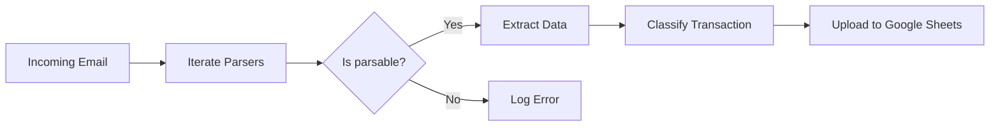

# Finmail
[](https://python.org)
[](https://python.org)

Finmail is a financial email processing system built with Azure Functions. It processes transactional emails, extracts the relevant financial data, and uploads it to a Google Sheet.

## Workflow
The following diagram illustrates the workflow of Finmail:


## Features

- **Email Processing**: Extracts relevant financial data from incoming emails.
- **Automatic Classification**: Categorizes transactions based on configurable rules stored in Google Sheets.
- **Azure Functions**: Leverages serverless architecture for scalability.
- **Google Sheets Integration**: Uploads processed data to Google Sheets for easy access and analysis.

## Google Sheets Setup

Finmail uses Google Sheets to store both transaction data and classification rules. To set up your spreadsheet:

### 1. Transactions Worksheet
This is where all processed transactions will be uploaded. The worksheet should have columns for:
- Date
- Pocket
- Category
- Currency
- Amount
- Description
- Notes
- (And any other transaction fields)

### 2. Classification Rules Worksheet
Create a worksheet named `Classification Rules` (or customize via `GOOGLE_CLASSIFICATION_WORKSHEET_NAME` setting) to automatically categorize transactions. This allows Finmail to intelligently assign categories to transactions based on patterns you define.

The worksheet should have **2 columns**:

| conditions | category |
|---|---|
| merchant:.*uber.* | Transport |
| pocket:.*Rappi.* AND description:.*food.* | Food |
| merchant:.*amazon.* | Shopping |

**How it works:**
- **conditions**: Expression with field and regex pattern in format `field:pattern`. Multiple conditions can be combined with `AND` (all must match).
- **category**: The category to assign when conditions match.
- Rules are evaluated in order, and the first matching rule wins.
- Pattern matching is case-insensitive.

**Supported fields**: `merchant`, `description`, `pocket`, `amount`, `currency`, and other transaction fields.

**Examples:**
- Single condition: `merchant:.*uber.*` → Matches any transaction where merchant contains "uber"
- Multiple conditions: `pocket:.*RappiPay.* AND amount:-.*` → Matches transactions from RappiPay pocket with negative amounts
- Pattern with colon: `description:.*https?://.*` → Matches descriptions containing URLs

**Note:** You can disable classification by setting `ENABLE_CLASSIFICATION=False` in your configuration.

## Getting Started
To get started with Finmail you need to have installed [UV](https://docs.astral.sh/uv/) for package management. Once you have UV installed, follow these steps:

1. Clone the repository.
2. Install dependencies using `make install`.
3. Set up local environment variables in a `local.settings.json` file like this:
    ```json
    {
      "IsEncrypted": false,
      "Values": {
        "AzureWebJobsStorage": "UseDevelopmentStorage=true",
        "FUNCTIONS_WORKER_RUNTIME": "python",
        "GOOGLE_SHEETS_CREDENTIALS_JSON": "<your-google-sheets-credentials-json>",
        "GOOGLE_SHEETS_SPREADSHEET_ID": "<your-google-sheets-spreadsheet-id>"
      }
    }
    ```
4. Install Azure Functions Core Tools.
    * MacOS:
        ```bash
        brew tap azure/functions
        brew install azure-functions-core-tools@4
        ```
5. Start the Azure Functions host.
    ```bash
    make start
    ```

### Send Test Requests

You can use tools like `jq` or `curl` to send test requests to the Azure Functions endpoint. For example:

```bash
brew install jq
```

In this case `jq` is used to format the JSON payload for the request. You can use the following command to send a test email payload:
```bash
jq -n \
  --arg subject "RappiCard - Resumen de transacción" \
  --arg sender "rappi.nreply@rappi.com" \
  --rawfile html tests/html_samples/rappicard.html \
  '{subject:$subject, sender:$sender, html:$html}' \
| curl -sS -X POST http://localhost:7071/api/ingest \
    -H "Content-Type: application/json" \
    -d @-

```

## Contributing

Contributions are welcome! Please open an issue or submit a pull request.
